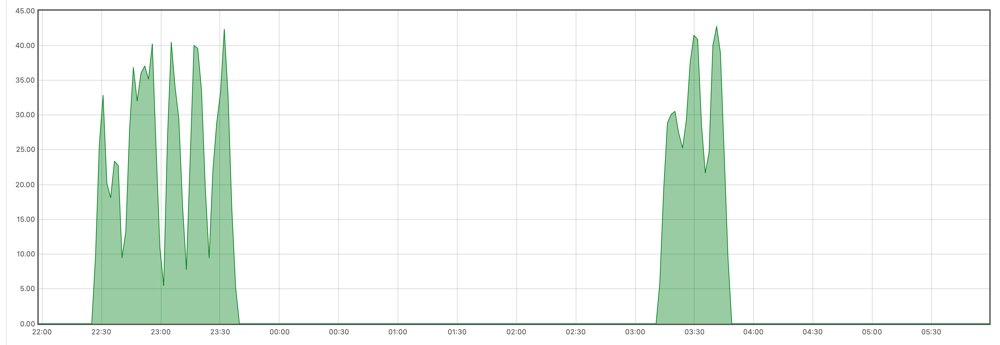

## Hamster wheel odometer

Our hamster is incredibly shy about using his exercise wheel and will not use it if anyone is watching.

We added a Hall effect odometer to the wheel to track his mileage.

## Parts

Hall effect sensor

Strong magnet

Bluetooth Arduino board

## Approach

The magnet is attached to the back face of the wheel. 
The sensor is suspended from the lid of the enclosure.
As the wheel revolves the magnet should trigger the sensor once per revolution.

We'll use the Arduino to capture an incrementing count of the wheel revolutions.

The Hall effect sensor has a digital output which could have been used to trigger a hardware interrupt
on the Arduino. In practise it was not sensitive enough and did not trigger. 

Instead, we poll the sensor's analouge output

In the absense of the magnet this output averages around 480 units.
In the presense of the magnet it can swing +- 30 to 50 units either way. 
It's a fairly weak signal and requires fairly careful alignment on the sensor.

The wheel wobbles quite abit; if I was doing this again I'd make sure I attached the magnet to the point
where the wheel bows out the most.

## Code

[hamster-wheel.ino](hamster-wheel.ino)

The polling code looks for a single with is more than 15 units from the defined midpoint.
As well as incrementing the counter it sets a debouncing timeout and flashes the Arduino's onboard LED.
The LED is useful for realigning the sensor after cleaning the enclosure.

I'm using the Bluetooth beacon feature of the Adafruit board to broadcast the counter.
When the count is incremented, it is written into the Bluetooth payload. The board will broadcast this value
continously until it is next updated.

A network connected Raspberry PI in another part of the house listens for these Bluetooth broadcasts and forwards them onto an MQTT channel.
I've used this pattern before on my power meter integration and think it's a reaonable alteranative to having to install a fully networked
device in a small place. The Arduino board only needs 5V power; no wired or Wifi network connection.

The count is progated via MQTT and ends up recorded in a Prometheus time series.
I could see this trace immediately.

## Results

The first night with the counter in place produced this graph in Prometheus.

3000 odd revolutions over 2 distinct sessions. The first session starts almost immediately after the lights are turned off.
The slope of the line is really consistent.

Given that the wheel is approximately 29cm in diameter this given a distance of approximately 2.7km in 1 night!

Prometheus can correct for counter resets and infer the rate of increase for us.

Averaging the rate of increase per second over a rolling 5 minute interval (to smooth the graph) and multiplying by 60 to show revolutions per minute (RPM):

Period of activity are clearly visible:

